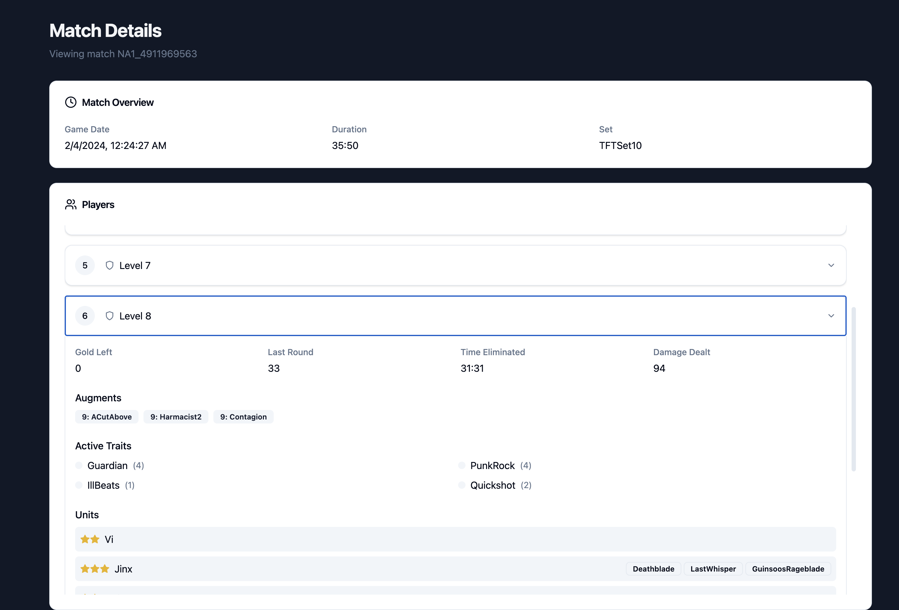

# an api response viewer for Teamfight Tactics

This API wrapper serves as a foundational tool for implementing more in-depth analysis of key data points from the game’s API. I plan to use it to gain insights and explore deeper analysis possibilities with ML or Data Processing use cases as I develop a better understanding of the available data.

NOTE: the current implementation uses a hardcoded api output from 2024 since [Riot developers plan to limit vital api aspects for Set 13](https://x.com/Mortdog/status/1856785428852216007)

### current technical considerations
- Java/Spring Boot/Maven
- React/Typescript/Vite/Tailwind/Shadcn
- REST assured/Lombok
- no database currently needed (processing one match at a time)
- API integration testing (TODO)
- Riot API

### intent
- provide a visual dashboard that indicates what the tft match api returns
- which will provide a clearer picture for how else to apply this returned data for match analysis, as exemplifed more thoroughly by [tactics.tools](https://tactics.tools/)
- per-turn analysis is only possible with image capture of the player's screen as shown in tft improvement tools like overwolf / dak.gg
    - this is how these other platforms get more thorough analysis beyond what is returned by the riot api