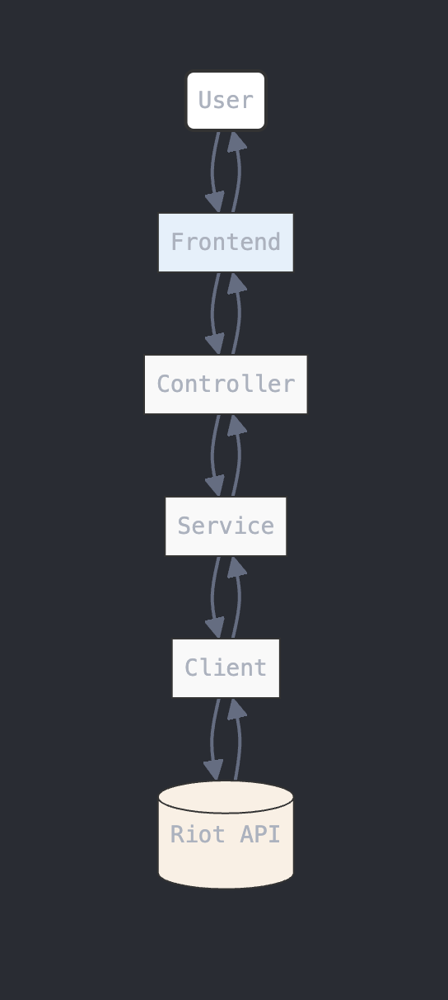

# a tft api output visualization

for ease of use, I've made this application possible to display match details based on matchID which can be pulled by your riotID(multiple matches) or a matchID

you can grab a matchid from the url of your profile on [tactics.tools](https://tactics.tools/player/na/)

```
# real example
https://tactics.tools/player/na/PLAYER/PRIM3/NA1_5107918675

# example with descriptions
https://tactics.tools/player/na/{username}/{usertag}/{matchID_copy_this}
```

### current stack
- Java/Spring Boot/Maven
- React/Typescript/Vite/Tailwind
- REST assured/Lombok
- no database needed (processing one match at a time)
- API integration testing (TODO)
- Riot API

### intent
- provide a visual dashboard that indicates what the tft match api returns
- which will provide a clearer picture for how else to apply this returned data for match analysis, as exemplifed more thoroughly by [tactics.tools](https://tactics.tools/)
- per-turn analysis is only possible with image capture of the player's screen as shown in tft improvement tools like overwolf / dak.gg
    - this is how these other platforms get more thorough analysis beyond the riot api

